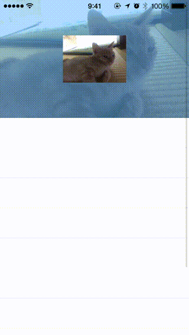

# ARNHeaderStretchFlowLayout-Swift

## Usage

To run the example project, clone the repo, and run `pod install` from the Example directory first.

## Requirements

* iOS 8.0+

- CcoaPods 0.36.0+ (if use CcoaPods)

## Objective-C Version

[ARNHeaderStretchFlowLayout](https://github.com/xxxAIRINxxx/ARNHeaderStretchFlowLayout)

* iOS 6.0+

## Installation

ARNHeaderStretchFlowLayout-Swift is available through [CocoaPods](http://cocoapods.org). To install
it, simply add the following line to your Podfile:

    pod "ARNHeaderStretchFlowLayout-Swift"

### Carthage

please wait..

## License

ARNHeaderStretchFlowLayout-Swift is available under the MIT license. See the LICENSE file for more info.
